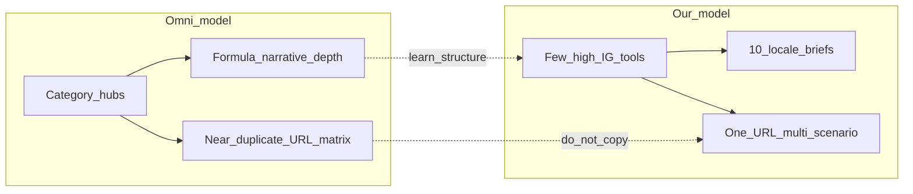

# Omni Calculator 对标：SEO 流量策略

**日期**: 2026-08-08  
**标签**: `SEO`, `竞品`, `Omni Calculator`, `计算器`, `Information Gain`, `Bing`  
**目标站点**: https://onlinefreetools.org

**关联文档**:

- 竞品快照：[competitor-refs/omnicalculator-2026-08-08/README.md](./competitor-refs/omnicalculator-2026-08-08/README.md)
- 公式精选：[omnicalculator-formula-ref-shortlist.tsv](./competitor-refs/omnicalculator-2026-08-08/omnicalculator-formula-ref-shortlist.tsv)
- 工具方向：[2026-07-28-tool-direction.md](./2026-07-28-tool-direction.md)（A.7 / C-V4·V5 / 附录）
- 清单总表：[2026-08-08-tool-inventory-table.md](./2026-08-08-tool-inventory-table.md) §9（Omni 意图合并 · `how-to-calculate-*`，62 行）/ §12
- 意图合并 TSV：[omnicalculator-intent-merge-howto.tsv](./competitor-refs/omnicalculator-2026-08-08/omnicalculator-intent-merge-howto.tsv)
- GSC 现行策略：[seo/reviews/2026-08-12/02-next-strategy.md](./seo/reviews/2026-08-12/02-next-strategy.md)
- **长尾缺口优先（选题，2026-08-20）**：[seo/2026-08-20-long-tail-gap-strategy.md](./seo/2026-08-20-long-tail-gap-strategy.md) — 不与 Omni 等抢已占位大词；主攻未覆盖长尾
- Google 落地：[2026-07-28-google-seo-strategy-implementation.md](./2026-07-28-google-seo-strategy-implementation.md)

**规则权威（本文不重复立法）**：核心「一带多场景 / 禁 doorway」已在 `.cursor/rules` 中——`seo-google-policy.mdc`、`tool-i18n-seo.mdc`、`tool-creation.mdc`、`tool-i18n-localization.mdc`。本文是 **Omni 对标下的执行策略与示例展开**；冲突时以 Google Search Central 现行文档与上述 rules 为准。

---

## 0. 一句话结论

Omni 用 **海量拆页 + 公式叙事** 垄断 en 计算器长尾。本站可行路径是：**不正面硬刚其已占位大词** → 收割本站已曝光意图的 CTR → **主攻 Omni/同类站未覆盖或极薄的长尾与语言缺口** → IndexNow/可引用结构吃 Bing/Copilot。页数不是杠杆；Information Gain 与缺口选题才是。选题立法见 [seo/2026-08-20-long-tail-gap-strategy.md](./seo/2026-08-20-long-tail-gap-strategy.md)。

---

## 1. Omni 站点解剖（2026-08-08 快照）

| 维度 | Omni 做法 | 对本站含义 |
|---|---|---|
| 规模 | **3867** 个 en 工具页，14 个品类 hub | 页数竞赛 = Google **scaled content** / Bing **duplicate & crawl waste**；禁止复制 |
| 品类权重 | math 679 / finance 604 / physics 537 / health 435 / conversion 326 … | 重叠区：**finance / health / math / statistics / conversion / construction**；biology/ecology/sports 深长尾默认不做 |
| URL 矩阵 | 州税、`bmi-men/women/kids`、`90/95/99-confidence-interval`、`16-9-aspect-ratio` 等 | 一律 **一带多场景**（见 §5） |
| 内容强项 | 公式讲解深度、可引用叙事（近 calculator.net） | **学结构，不学页数**：Rules / Example / 边界 / References |
| 语言 | 多语 alternate（pt/de/es/it/fr/pl…），**无 zh** | **中文 + 十语实质本地化**是结构缺口 |
| 公式对照 | shortlist 已映射约 33 个本站 slug（含已上线 6 个） | 策略服务该池，不重新扫全站铺量 |

---

## 2. 本站起点

- Catalog：**58** 工具；`calculator` **6** 个已上线（BMI / ROI / MR / sqft / %change / gradient）。
- GSC（2026-08-02～05）：~283 展示、**1** 点击；计算器相关展示已出现在 es sqft、es/pt/fr ROI、ja MR、es BMI——矛盾是 **有曝光无点击 / 排名偏后**，不是「没有计算器关键词」。
- 现行 P0（[02-next-strategy](./seo/2026-08-08/02-next-strategy.md)）：CTR/meta 对齐；本文 **叠加** Omni 对标，不推翻。
- Bing：IndexNow + meta≥120 已具备；指南强调 URL 合并、单主题、信息前置、可独立验证、勿用 nosnippet/noarchive 阻断 grounding。

---

## 3. Google × Bing 硬约束（执行红线）

### 3.1 两边都禁止

- 按 Omni 规模批量生产近义计算器 URL  
- 未实质编辑的机翻/AI 铺页  
- 抄袭 Omni 正文（scraped / republished without value）

### 3.2 两边都奖励

- 真实可交互 + 公式/步骤/示例/边界  
- 每 URL **单一主意图**；长尾进 Use cases / FAQ  
- YMYL：disclaimer + 权威 References  
- canonical / hreflang / 内链；sitemap 仅优质规范 URL  
- 工具页保持 snippet-eligible（勿 `nosnippet`；勿对工具页 `noarchive`/`nocache`）

### 3.3 引擎差异（执行层）

| | Google | Bing / Copilot |
|---|---|---|
| 发现 | GSC + 自然爬取 | **IndexNow 增量** + Bing WMT |
| AI 可见性 | 标准 SEO；禁 AI 专用 hack（无 `llms.txt` / AI 专用 schema） | 同基础 SEO；强调可引用结构（问句 H2、表、靠前结论） |
| KPI | 点击 / CTR / 排名 | 索引 + 展示；后期可看 citation（有数据再定） |
| Meta | 检索主词前置 | description **≥120**（`lint:seo`） |

---

## 4. 主策略：漏斗倒置（四层）

**先收割已曝光计算器意图 → 再按 shortlist P1 补高意图页 → 用十语 IG 打语言面；全程禁铺量。**  
不建空壳品类 hub；导航靠首页分组 + Related tools 簇。

### 4.1 层 A — 已上线 6 页（最高 ROI，2–4 周）

1. **SERP 对齐**：title 前置该语检索主词；description 首句重复意图。  
2. **正文第二轮**（仅持续高展示、低点击或排名>50 的语）：按 `work-tasks/{slug}/03-locale-briefs.md` 重写 How/Example/FAQ——学 Omni 的「公式+边界」结构，**不是翻译 Omni**。  
3. **场景吞并**：Omni 拆页意图写入 Use cases/FAQ（§5）。  
4. **内链簇**：ROI↔MR↔%change；BMI↔未来 BMR；首页 calculator 卡片可见。

### 4.2 层 B — shortlist P1 新工具

| 优先级 | slug | 对标 Omni（对照公式，不拆变体） |
|---|---|---|
| P1 | `how-to-calculate-compound-interest` | `/finance/compound-interest`（+ simple-interest 同页） |
| P1 | `how-to-calculate-emi` | `/finance/emi` + amortization + mortgage **同页** |
| P1 | `how-to-calculate-bmr-tdee` | `/health/bmr` + `tdee` + calorie **同页** |
| P1 | `how-to-calculate-break-even` / `how-to-calculate-gross-margin` | 对应 finance URL |

完整合并清单见清单 §9 与 `omnicalculator-intent-merge-howto.tsv`（62 意图）。

硬门槛：可交互 + 公式表 + Example + 边界 + YMYL disclaimer + References；en/zh 满 IG；L2 brief 检索词进 title/H1/首段；上线后 IndexNow；`lint:seo` 通过。节奏：每周 1–2 个含十语审核（方向文档红线）。

### 4.3 层 C — 语言套利

1. **zh 优先**（Omni 无 zh）：复利/月供/BMR 等中文检索深度 + 权威引用。  
2. **L2 跟随 GSC**：es/de/pt/fr/ja 优先；ar/id/ru 有 brief 再推 IndexNow。  
3. **不跟**美式州税 / 401k 长尾矩阵；US en 打通用公式头词 + 教育意图。

### 4.4 层 D — Bing / Copilot

1. 新页与重大文案更新：`indexnow --since-git` / incremental。  
2. 结论与公式表靠前；FAQ 用自然语言问句。  
3. 确认 Bing Webmaster Tools 已验证站点与 sitemap（未验证则运维 P0）。  
4. 不做 `llms.txt` / AI 专用 schema。

### 4.5 明确不做

- 复制 conversion≈326 / finance≈604 拆页矩阵  
- 为每个 GSC/Bing 查询建新 URL  
- 空壳 hub、州税、男女 BMI、90/95/99 CI、16:9/4:3 独立页  
- 以 FAQ 富结果或「进 AI Overview」为 KPI  
- 可见正文写「对照 Omni / 不拆 URL」等 SEO 元叙述  

---

## 5. 一页吃长尾场景，不拆页（策略展开）

> **规则已立法**（`tool-i18n-seo.mdc`「长尾与拆页」等）。本节用 Omni 反例说明**怎么执行**。

### 5.1 定义

**同一个计算意图只留一个规范 URL**；近义词、人群、参数档位写进同一页的控件 / Use cases / FAQ / Example，而不是各建薄页。

- **主意图** → 决定 slug 与 title/H1  
- **外围长尾** → 决定页内文案与参数 UI，**不**决定新 slug  

### 5.2 Omni 拆页 vs 本站合并

| Omni（多 URL） | 本站（一页） |
|---|---|
| `bmi` / `bmi-men` / `bmi-women` / `bmi-kids`… | `how-to-calculate-bmi`；人群进 FAQ/边界 |
| `percentage-change` / `increase` / `decrease` | `how-to-calculate-percentage-change` |
| `90/95/99-confidence-interval` | 未来 `confidence-interval`，置信水平做选项 |
| `16-9-aspect-ratio` / `4-3-aspect-ratio`… | 未来 `aspect-ratio-calculator`，预设当输入 |
| 州税、car/home/bike-emi | 不做州税矩阵；EMI/摊还合并评估 |

### 5.3 页内承接位置

1. **首屏计算器** — 能用控件吞的长尾用控件（单位、置信水平、宽高比预设）。  
2. **Rules / 公式表** — 主公式 + 边界（可索引）。  
3. **Example** — 完整数值例（涨+跌、公制+英制等）。  
4. **Use cases（≥2–3）** — 真实场景句，自然带长尾说法。  
5. **FAQ（≥3）** — 问句对齐用户搜法（儿童 BMI？涨跌同一公式？）。  
6. **YMYL** — disclaimer + References。  

Title/H1 钉主意图；次词进 description / FAQ / Use cases。

### 5.4 何时才允许拆页

须**同时**满足：功能/算法/参数实质不同；去掉 title 后正文仍明显不同；各自满 IG；不会形成仅换词矩阵。

| 可拆 | 不可拆 |
|---|---|
| BMI vs BMR/TDEE | BMI 男 vs 女 |
| 复利 vs ROI | 百分比涨 vs 跌 |
| 宽高比计算器 vs CSS 渐变生成器 | 16:9 vs 4:3 各一页 |

### 5.5 可见文案边界

禁止在用户正文写「我们不拆页 / doorway / 薄页」。理由只留 `work-tasks/` 与 `docs/`（本文件属 docs）。

---

## 6. `how to calculate xxx` 命名策略

可作**意图层命名**，不可作批量 URL 工厂。

| 主检索意图 | 建议 |
|---|---|
| how to calculate / 怎么算 / 求め方 / cómo calcular | slug 可用 `how-to-calculate-{topic}`；title 写该语自然说法 |
| X calculator / 计算器 / calculadora | 短 slug（如 `compound-interest`、`loan-emi`）；title 仍可覆盖 “how to” |

硬规则：

1. **一意图一 URL** — 禁止同主题再拆 `roi-calculator` 与 `how-to-calculate-roi`。  
2. **禁止**把 Omni ~3867 页改写成 how-to-calculate 矩阵。  
3. slug 可统一英文 kebab；可见 title 用当地说法。  

落地：已上线 5 个 `how-to-calculate-*` 保持；P1 财务/健康按清单短 slug，靠 title+正文吃双重意图；仅当 coverage 证明 “how to” 显著强于 “calculator” 时，新工具才用该前缀。

Omni 自身多用短 path（`/finance/roi`），靠页内长文吃 “how to” 流量——本站用 slug 或 title 承接皆可，关键是**单 URL + 深度内容**。

---

## 7. 相同搜索意图下如何抢部分流量

抢的是**份额**，不是唯一第一。杠杆顺序：

1. **SERP 点击份额（当前最高杠杆）**  
   已有展示、CTR≈0（如 ja MR 排名~9 仍 0 点击）。title 前置查询词；description 首句重复意图并写清差异（免费可算 / 公式可见 / 该语说法）。

2. **落地页满足差异**  
   即时计算 + 公式表 + 数值例 + 边界/免责 + References；首屏能出结果。

3. **语言切片**  
   zh（Omni 无）+ 已有展示的 L2 实质本地化，抢「同意图不同语」。

4. **一页吃长尾（§5）**  
   相关查询展示汇到同一规范 URL。

5. **排名与发现**  
   计算器互链 + 时间 + IndexNow；Bing 侧可引用结构争取 citation 可见性。

不该做：同意图双 URL、抄 Omni 正文、为每个近义词建页。

---

## 8. 成功度量（8–12 周）

| 指标 | 基线（2026-08-08） | 目标方向 |
|---|---|---|
| GSC 计算器相关点击 | ~0（站总点击 1） | 先到稳定有点击，再谈份额 |
| 已曝光页 CTR（ja MR、es sqft 等） | 0% | 元/正文对齐后 CTR >0 |
| 新 P1 页 | 0 上线 | 周 1–2；IndexNow 后 28 天内见展示 |
| 索引健康 | 未编入仍多 | 内链 + 时间；禁用薄页堆索引 |
| 合规 | — | 无 doorway 矩阵；YMYL 页均有 disclaimer+References |

与下轮 GSC 决策门对齐见 [seo/2026-08-08/02-next-strategy.md](./seo/2026-08-08/02-next-strategy.md)。

---

## 9. 与站内规则 / 文档的关系

| 主题 | 立法位置（rules） | 本文职责 |
|---|---|---|
| 一带多场景 / doorway | `seo-google-policy` · `tool-i18n-seo` | Omni 反例 + 页内承接清单 |
| 次词落点、禁拆近义 URL | `tool-i18n-localization` | how-to 命名与双重意图 |
| 页面区块 / IG | `tool-creation` · `tool-i18n-seo` | 计算器对标硬门槛 |
| 产品排期 / slug 池 | 工具方向 · 清单 §9–§12 · shortlist TSV | 流量层 B 优先级 |
| GSC 短期动作 | `docs/seo/2026-08-08/*` | 层 A 与 CTR 叠加 |

**不在本轮**：批量新开计算器代码；新工具仍走 `tool-creation` + `coverage:gate`。
