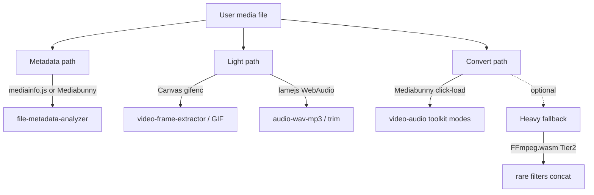

# 浏览器端音视频方案继续调研

**日期**: 2026-08-09  
**范围**: 纯客户端（不上传）读元数据 / 截帧 / 裁剪 / 转码 / 录制；对照 Aconvert Video+Audio 工具动作。  
**关联**: [FFmpeg ↔ Aconvert 对照](./2026-08-09-ffmpeg-wasm-vs-aconvert-av-and-ebook-alts.md) · [试点选项](./2026-08-09-browser-media-ebook-pilot-options.md) · [音视频可行性 2026-06](./2026-06-23-10-15-js-media-conversion-feasibility.md) · [电子书客户端续研](./2026-08-09-browser-ebook-client-solutions.md)

---

## 1. 先分清四档能力

| 档 | 含义 | 体积量级 | 相对 Aconvert |
|---|---|---|---|
| **L0 原生 API** | 截帧、简单录制、Web Audio 切片/混音 | 0 | Extract 帧、录音、部分 Cut |
| **L1 轻库** | MP3 编码、GIF、MP4 解析/封装 | KB～百 KB gzip | Convert 窄路径、GIF、元数据子集 |
| **L2 WebCodecs 工具包** | 硬件加速转封装/转码/裁剪/缩放（浏览器能编的码） | ~0.2–0.5 MB gzip（+可选编码器扩展） | 多数 Video/Audio 工具动作（主流格式） |
| **L3 FFmpeg.wasm** | 近 CLI 滤镜/冷门容器 | **~31 MiB** wasm（gzip ~10 MiB） | 更广容器；仍非 WMV/RM 全家桶 |

**结论**：不必一上来绑 L3。多数「对标 Aconvert 工具动作」可先 **L0+L1**，转码主路径优先评估 **L2 Mediabunny**；L3 仅作冷门/滤镜兜底。

---

## 2. 方案矩阵（2026-08-09 实测体积）

### 2.1 L0 — 浏览器原生（零依赖）

| API | 能力 | 限制 |
|---|---|---|
| `<video>` + Canvas / `requestVideoFrameCallback` | 截帧、封面、逐帧→GIF 输入 | 仅浏览器能解的容器；无通用转码 |
| **Web Audio** `decodeAudioData` + OfflineContext | 解码→切片/拼接/音量；导出需编码器 | 整文件进内存；编码靠 L1/L2 |
| **MediaRecorder** | 麦/屏/Canvas 流 → WebM(Opus) / MP4(视浏览器) | 输出格式随 UA；非任意文件转码 |
| **WebCodecs**（裸用） | `VideoEncoder`/`AudioEncoder` 高效编解码 | 配置难；需自配 demux/mux |

### 2.2 L1 — 轻量专用库

| 方案 | 许可 | 体积（实测） | 能力 | 本站评价 |
|---|---|---|---|---|
| **[@breezystack/lamejs](https://www.npmjs.com/package/@breezystack/lamejs)** 1.2.7 | LGPL-3.0 | `lamejs.js` ≈ **253 KiB** / gzip9 **~65 KiB** | WAV/PCM → MP3 | **音频 P0**（清单 `audio-wav-mp3`）；优于老 `lamejs` 巨包 |
| **[gifenc](https://www.npmjs.com/package/gifenc)** 1.0.3 | MIT | esm ≈ **9 KiB** / gzip **~3.8 KiB** | 帧序列 → GIF | **已在 `package.json`**；短视频转 GIF |
| **[mp4box](https://www.npmjs.com/package/mp4box)** 2.4.1 | BSD-3-Clause | `mp4box.all.mjs` ≈ **90 KiB** / gzip **~16 KiB** | ISOBMFF 解复用/元数据/抽轨 | Analyzer、抽音视频轨（MP4 系） |
| **[webm-muxer](https://www.npmjs.com/package/webm-muxer)** / **[mp4-muxer](https://www.npmjs.com/package/mp4-muxer)** | MIT | gzip ~**12 / 14 KiB** | WebCodecs 编码后封装 | 作者已指向 **Mediabunny** 迁移；新项目直接用 L2 |
| **audiobuffer-to-wav** 等 | MIT | 极小 | AudioBuffer → WAV | 与 lamejs 配对 |
| **extendable-media-recorder** / opus-media-recorder | MIT | 中 | 录音格式扩展 | 对齐 `audio-recorder` |

### 2.3 L2 — WebCodecs 全家桶（推荐转码主路径）

| 方案 | 许可 | 体积（实测） | 能力摘要 | 本站评价 |
|---|---|---|---|---|
| **[mediabunny](https://mediabunny.dev/)** 1.53.0 | **MPL-2.0** | 全量 bundle min ≈ **632 KiB** / gzip9 **~161 KiB**；tree-shake 可更小；npm pack 1.9 MB | 读/写/Conversion：MP4/MOV/WebM/MKV/MP3/WAV/Ogg/FLAC/AAC/TS/HLS…；裁剪/缩放/旋转/重采样；硬件编解码 | **转码主候选**；编解码能力随 **浏览器 WebCodecs** 变化，须 `canEncode`/`canDecode` |
| **@mediabunny/mp3-encoder** 1.53.0 | MPL-2.0 | 单文件含 LAME WASM ≈ **304 KiB** / gzip9 **~129 KiB**（文档称 ~130 kB gzip） | 补 WebCodecs 无的 MP3 编码 | 与 Mediabunny Conversion 集成；也可只用 lamejs |
| **@mediabunny/aac-encoder** / flac / ac3 / prores | MPL-2.0 | 扩展包（按需） | 补平台缺口 | 按 POC 再引 |
| **[@webav/av-cliper](https://www.npmjs.com/package/@webav/av-cliper)** + av-canvas 1.2.8 | （查包页） | unpacked ~662 KiB / ~187 KiB | 时间线合成、动画、录制导出 | **编辑/合成**向；转码站次选；中文文档友好 |
| **@remotion/webcodecs** | **Remotion 专有许可** | unpacked ~579 KiB | 浏览器转换 | **默认不做**（许可不适合本站开源工具页） |

**Mediabunny 容器（官方）**：mp4/mov/m4a、mkv、webm、ogg、mp3、wav、aac(ADTS)、flac、mpeg-ts、HLS。  
**编解码**：依赖 WebCodecs 的 AVC/HEVC/VP8/VP9/AV1、AAC/Opus/Vorbis/FLAC… + PCM；**不承诺** Aconvert 的 WMV/RM/旧 AVI 专有码。

### 2.4 L3 — 重量级 WASM

| 方案 | 许可 | 体积（实测） | 能力 | 本站评价 |
|---|---|---|---|---|
| **@ffmpeg/core** 0.12.10 | **GPL-2.0-or-later** | wasm **31.2 MiB**；gzip ~**9.8 MiB** | 滤镜、拼接、广容器、字幕等 | 兜底；点击加载；合规评审 |
| **mediainfo.js** 0.3.7 | BSD-2-Clause | `MediaInfoModule.wasm` ≈ **2.45 MiB** / gzip9 **~940 KiB** | 详尽媒体元数据 | **File Analyzer** 强候选；比解析 ffmpeg 日志稳 |

---

## 3. Aconvert 工具动作 → 推荐技术栈

| Aconvert | 首选栈 | 备选 |
|---|---|---|
| Video **Extract**（帧/封面） | L0 Canvas | Mediabunny 抽帧；FFmpeg `-vframes` |
| Video **Cut** | Mediabunny Conversion trim | FFmpeg `-ss/-to`；流复制仅同编码 |
| Video **Compress** / 改分辨率码率 | Mediabunny（WebCodecs 重编码） | FFmpeg |
| Video **Rotate / Crop / Pad** | Mediabunny（Canvas 变换） | FFmpeg `-vf` |
| Video **Merge** | ⚠️ Mediabunny / WebAV 时间线 | FFmpeg concat（更熟） |
| Video **Convert**（MP4↔WebM 等） | **Mediabunny** | FFmpeg；GIF→**gifenc**+Canvas |
| Video → GIF | Canvas 抽帧 + **gifenc**（已有） | FFmpeg |
| Audio **Convert** WAV↔MP3 | **lamejs**（+ decodeAudioData） | Mediabunny + mp3-encoder |
| Audio Cut / Merge / Compress | Web Audio 或 Mediabunny | FFmpeg |
| Audio **Extract**（从视频） | mp4box / Mediabunny demux | FFmpeg `-vn` |
| **Analyze** | **mediainfo.js** 或 Mediabunny metadata | mp4box（仅 MP4 系） |
| WMV / RM / 冷门 | ❌ 勿承诺 | 即使 FFmpeg.wasm 也弱 |

---

## 4. 推荐架构（本站）

### 4.1 工具阶段（SEO：少 slug、页内模式）

| 阶段 | slug | 栈 | 说明 |
|---|---|---|---|
| **P0a** | `video-frame-extractor` | L0 Canvas（+可选 gifenc 短 GIF） | 零/近零 WASM；对冲 *video to jpg* |
| **P0b** | `audio-wav-mp3` | L1 lamejs + Web Audio | 清单已有待 POC |
| **P1** | `file-metadata-analyzer` | mediainfo.js（懒加载 ~1 MB gzip）或 Mediabunny 只读元数据 | 对标 Aconvert Analyze |
| **P1/P2** | `media-convert` 或 `video-toolkit` | **Mediabunny** + 按需 mp3-encoder | Cut/Compress/Convert/Extract 音轨；支持表写死；`canEncode` 探测 |
| **P2 可选** | 同页「高级引擎」 | FFmpeg.wasm | 仅当 Mediabunny 无法满足的滤镜/拼接 |
| **不做** | 格式对 URL、WMV/RM 承诺、Remotion 专有栈 | — | — |

### 4.2 Mediabunny vs FFmpeg.wasm（选型）

| 维度 | Mediabunny | FFmpeg.wasm |
|---|---|---|
| 体积 | min gzip **~161 KiB**（+MP3 ~129 KiB） | wasm **~31 MiB** |
| 速度 | WebCodecs **硬件加速** | WASM 软解软编，慢 |
| 格式 | 现代 Web 主流；随 UA | 容器更广，仍非无限 |
| 许可 | **MPL-2.0**（弱传染，须合规注意修改文件） | core **GPL-2.0-or-later** |
| API | Conversion 一等公民 | CLI 字符串，灵活滤镜 |
| Safari/移动 | 受 WebCodecs 支持表约束 | 内存更敏感 |

**默认**：新转码工具以 **Mediabunny 为主路径**；FFmpeg 作显式可选兜底，不双开首屏。

### 4.3 许可速记

| 包 | 注意 |
|---|---|
| Mediabunny MPL-2.0 | 修改其源文件需开源该文件；链结使用通常可接受——上线前法务确认 |
| lamejs LGPL-3.0 | 动态链接/WASM 常见用法；勿静态吞进闭源无声明 |
| FFmpeg core GPL | 传染风险更高；产品默认谨慎 |
| Remotion | **排除** |
| gifenc MIT / mp4box BSD | 友好 |

---

## 5. 与旧文档增量

| 文档 | 更新要点 |
|---|---|
| `2026-06-23-…-media-conversion-feasibility.md` | 当时结论「视频几乎靠 FFmpeg」已过时；补 **Mediabunny / WebCodecs** 为第一候选 |
| `ffmpeg-wasm-vs-aconvert-…` | 操作覆盖仍成立；实现栈改为「Mediabunny 优先」 |
| 试点选项套餐 A/C | A：Canvas+lamejs；C：可改为 Mediabunny 试点，FFmpeg 降为 C-heavy |

---

## 6. 下一步（待确认）

1. 转码主引擎：`Mediabunny` / `FFmpeg` / `先 L0+L1 不起转码页`  
2. Analyzer：`mediainfo.js` vs Mediabunny metadata  
3. 是否接受 MPL-2.0 / LGPL 依赖（默认：可接受，写入 NOTICE）  
4. 确认后 POC：Chrome/Safari 桌面各跑 Convert+Cut+Extract；再 `work-tasks/`
