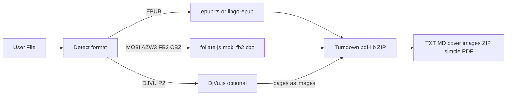

# 浏览器端电子书方案继续调研

**日期**: 2026-08-09  
**范围**: 纯客户端（不上传）解析 / 预览 / 导出；**不含** Calibre 级全格式互转站。  
**关联**: [FFmpeg ↔ Aconvert + ebook 初稿](./2026-08-09-ffmpeg-wasm-vs-aconvert-av-and-ebook-alts.md) · [试点选项](./2026-08-09-browser-media-ebook-pilot-options.md) · [Aconvert 快照](./competitor-refs/aconvert-2026-08-09/README.md)

---

## 1. 先分清三类能力（避免和 Aconvert 混谈）

| 能力档 | 含义 | 浏览器现实 | Aconvert 对照 |
|---|---|---|---|
| **A. 读 / 解析** | 打开书、目录、封面、章节 HTML/文本 | ✅ 成熟 | 非其主卖点 |
| **B. 导出** | → TXT / Markdown / 图 ZIP / 简 PDF | ✅ 可行 | 部分 intent（epub to txt） |
| **C. 格式互转写出** | EPUB↔MOBI↔AZW3↔PDF 高保真 | ❌ 轻量栈基本不可；WASM 巨石实验 | **其主卖点** |

本站策略应停在 **A+B**；C 继续默认不做（doorway + 体量 + 虚假保真风险）。

---

## 2. 库与产品对照（2026-08-09 实测 / 查阅）

### 2.1 EPUB 专用（读 + 导出底座）

| 方案 | 许可 | 体积（实测） | 能力 | 维护 | 本站评价 |
|---|---|---|---|---|---|
| **[@likecoin/epub-ts](https://www.npmjs.com/package/@likecoin/epub-ts)** 0.7.1 | BSD-2-Clause | ESM `epub.js` ≈ **266 KiB** raw / **~64 KiB** gzip9；UMD ≈ **171 KiB** / **~47 KiB** gzip；npm 自称相对 epubjs gzip **−57%**（57.5 vs 132.8） | epubjs API：解析、Rendition 预览、TOC、CFI；依赖仅 **jszip** | ✅ 活跃（2026-08 仍发版） | **EPUB 首选**（替代老化 epubjs） |
| **[epubjs](https://www.npmjs.com/package/epubjs)** 0.3.93 | BSD-2-Clause | npm unpacked ~6.4 MB（含历史资产）；运行时 gzip 更大 | 同上，经典 | ⚠️ 上游停更感强 | 不新开；已有项目可迁 epub-ts |
| **[@lingo-reader/epub-parser](https://www.npmjs.com/package/@lingo-reader/epub-parser)** 0.4.6 | MIT | browser bundle ≈ **33 KiB** raw / **~8.5 KiB** gzip；+ fflate/jszip | **抽章节** API，偏导出非完整阅读器 | ✅ | 只要 TXT/MD、不要翻页 UI 时很合适 |
| **JSZip/fflate + 自研 OPF** | MIT | 极小 | 目录/封面/spine 遍历 | 自控 | 最小试点；要自己扛边缘 EPUB |

### 2.2 多格式阅读器内核（读 Kindle / FB2 / 漫画）

| 方案 | 许可 | 体积 | 格式 | 本站评价 |
|---|---|---|---|---|
| **[foliate-js](https://github.com/johnfactotum/foliate-js)**（npm `foliate-js@1.0.1`） | **MIT** | 模块合计 JS ≈ **262 KiB** raw / **~72 KiB** gzip9；按需：`epub.js`~12 KiB gz、`mobi.js`~12 KiB gz、`fb2.js`~4 KiB gz、`comic-book.js`~1 KiB gz | **EPUB、MOBI、KF8/AZW3、FB2、CBZ**；PDF 实验（要 pdf.js） | **多格式只读/抽文本首选**；KF8 HUFF 解压慢，须写进 FAQ |
| **[@lingo-reader/mobi-parser](https://www.npmjs.com/package/@lingo-reader/mobi-parser)** 0.4.6 | MIT | unpacked ~196 KiB | MOBI + KF8 spine/章节 | 可与 foliate 二选一；生态还有 epub/fb2 parser |
| **[@lingo-reader/fb2-parser](https://www.npmjs.com/package/@lingo-reader/fb2-parser)** 0.4.6 | MIT | unpacked ~65 KiB | FB2 | 小众；可并入同页 Tab |
| **Koodo [kookit](https://github.com/koodo-reader/kookit)** | **AGPL-3.0** | 整引擎（foliate + pdf.js + 7z-wasm + mammoth…） | 阅读器全家桶 | **勿整库引入**（AGPL + 过重）；可参考交互 |

生态旁证：`vue-book-reader` / `react-book-reader` 均以 foliate-js 为核——说明「工具页嵌阅读/导出」路径已被验证。

### 2.3 导出增强（HTML → 他格式）

| 方案 | 许可 | 体积 | 用途 |
|---|---|---|---|
| **turndown** (+ GFM 插件) | MIT | unpacked ~192 KiB；运行时小 | 章节 HTML → Markdown |
| **html-docx-js-typescript** | MIT | unpacked ~45 KiB | HTML → DOCX（简单） |
| **pdf-lib**（站内已有） | MIT | Tier 1 已用 | 章节文本/图 → **简 PDF**（非印刷级） |
| **epub2everything** 思路 | — | 组合上述 | MD / DOCX / 图库 ZIP / 简 PDF 产品参考 |
| **markitdownllm** 0.1.5 | MIT | unpacked ~248 KiB | 多格式→MD（含 EPUB spine）；可作「喂 LLM」单页参考 |

### 2.4 写出 EPUB（HTML → EPUB，非 Kindle）

| 方案 | 环境 | 备注 |
|---|---|---|
| `epub-gen` / `epub-gen-memory` / `@lesjoursfr/html-to-epub` | 多为 **Node** 或需适配 | 浏览器侧可自研「ZIP + OPF + XHTML」轻量打包；**不是** MOBI/AZW3 编码器 |
| 浏览器自研 EPUB writer | 可行 | 适合「TXT/MD/HTML → EPUB」桥；与 Aconvert「任意→AZW3」不同 |

### 2.5 冷门 / 扫描类

| 格式 | 方案 | 结论 |
|---|---|---|
| **DJVU** | [DjVu.js](https://github.com/RussCoder/djvujs)（官网 djvu.js.org；**无正式 npm 名**，自托管 build） | 可看/拆页/图转 djvu；**不是** djvu→epub 排版引擎；P2 可选「DjVu 查看/转图」 |
| **CHM / LIT / LRF / SNB…** | 无成熟轻量浏览器栈 | **不做** |
| **DRM Kindle** | — | **不做**（法律 + 技术） |
| **Calibre WASM / LibreOffice WASM** | 见前文档 | 互转向；默认不做 |

---

## 3. 相对 Aconvert Ebook 的格式覆盖（客户端）

Aconvert 输入示例：AZW, CBZ, CHM, DJVU, DOCX, EPUB, FB2, HTML, MOBI, PDF, TXT…  
输出：PDF AZW3 EPUB DOC DOCX FB2 HTML MOBI …  

| 格式 | 读/解析 | 导出 TXT/MD | 写出该格式 |
|---|---|---|---|
| EPUB | ✅ epub-ts / foliate / lingo | ✅ | ⚠️ 可自研轻量 writer |
| MOBI / AZW3 | ✅ foliate / lingo（无 DRM） | ✅ 文本级 | ❌ |
| FB2 | ✅ foliate / lingo | ✅ | ⚠️ 可写简单 XML，非优先 |
| CBZ | ✅ foliate comic | 图 ZIP / 简 PDF | ⚠️ 再打包 ZIP |
| PDF | ✅ 站内 pdf.js 路径 | ✅ 已有 `pdf-to-markdown` 等 | ✅ 已有 PDF 工具 |
| DOCX | ⚠️ mammoth（Koodo 用；非书） | ✅ HTML/MD | ⚠️ |
| DJVU | ⚠️ DjVu.js 渲染/转图 | 图/OCR 另议 | ⚠️ 库可压图→djvu |
| CHM/LIT/… | ❌ | ❌ | ❌ |
| AZW3/MOBI **输出** | — | — | ❌ |

---

## 4. 推荐架构（本站）

### 4.1 工具页建议（SEO：单页多格式，禁格式对 URL）

| 阶段 | 建议 slug | 用户任务 | 技术栈 | IG 要点 |
|---|---|---|---|---|
| **P0** | `ebook-text-export`（或先 `epub-unpack`） | 打开 EPUB → 目录/封面 → TXT/MD/图 ZIP | `@likecoin/epub-ts` 或 `@lingo-reader/epub-parser` + Turndown + fflate | 本地隐私、spine 规则、DRM 不支持、示例书 |
| **P1** | 同上页扩展输入 Tab | MOBI/AZW3/FB2/CBZ → 同上 | **foliate-js** 按需 `import()` | KF8 慢/失败边界；与 EPUB Tab 对照表 |
| **P2a** | 页内模式或 Related | HTML/MD → EPUB | 自研 ZIP+OPF 或移植 epub-gen-memory | 结构规则表 |
| **P2b** | 可选 | DjVu → 页图 / 元数据 | DjVu.js 自托管 | 体积与 Worker；非转 EPUB |
| **不做** | — | epub↔mobi↔azw3 矩阵、CHM、带 DRM | — | — |

与站内已有：`pdf-to-markdown`、`images-to-pdf`、封面多店 `ebook-cover-size-pack`（P2 清单）**Related 互链**，不合并成一个巨页。

### 4.2 选型默认（若只需拍板技术）

1. **EPUB 导出**：`@lingo-reader/epub-parser`（更轻）或 `@likecoin/epub-ts`（要页内预览时）  
2. **多格式扩展**：上游 **foliate-js**（MIT，模块按需）；勿引 Koodo kookit（AGPL）  
3. **MD**：Turndown + GFM  
4. **简 PDF**：现有 pdf-lib  
5. **永不默认**：Calibre WASM、写出 AZW3/MOBI、格式对薄页  

---

## 5. 风险与合规备忘

| 项 | 说明 |
|---|---|
| DRM | 明确拒绝；FAQ 写清 |
| KF8 性能 | foliate 自述 HUFF/CDIC 慢；大书要进度/超时文案 |
| 许可 | epub-ts BSD；foliate/lingo/turndown MIT；Kookit AGPL 勿嵌 |
| SEO | 一带多场景；intent 用 Use cases（epub to markdown / mobi to txt） |
| CWV | 多格式解析 **动态 import**；勿首屏打满阅读器 UI |
| 可见文案 | 只写用户边界；不写「因 doorway 不拆页」 |

---

## 6. 与前序文档的增量

| 文档 | 本次增量 |
|---|---|
| `ffmpeg-wasm-vs-aconvert-av-and-ebook-alts.md` | 仍成立；本文展开 ebook **客户端**库体积与阶段 slug |
| `browser-media-ebook-pilot-options.md` | 套餐 D 的 D1 应对齐本文 P0/P1（foliate 扩展） |
| Aconvert Ebook Hub | 客户端可吸「拆书/喂 LLM/抽封面」；不可吸「全家桶互转」 |

---

## 7. 下一步（待你确认后再做）

1. 定 slug：`epub-unpack` vs `ebook-text-export`  
2. P0 只做 EPUB 还是 P0 就带 foliate 多格式  
3. 是否要页内 **阅读预览**（推 epub-ts）还是 **纯导出**（推 lingo-parser）  
4. 确认后：`work-tasks/{slug}/` + `coverage:gate`（不插队现有 P0 除非明示）
