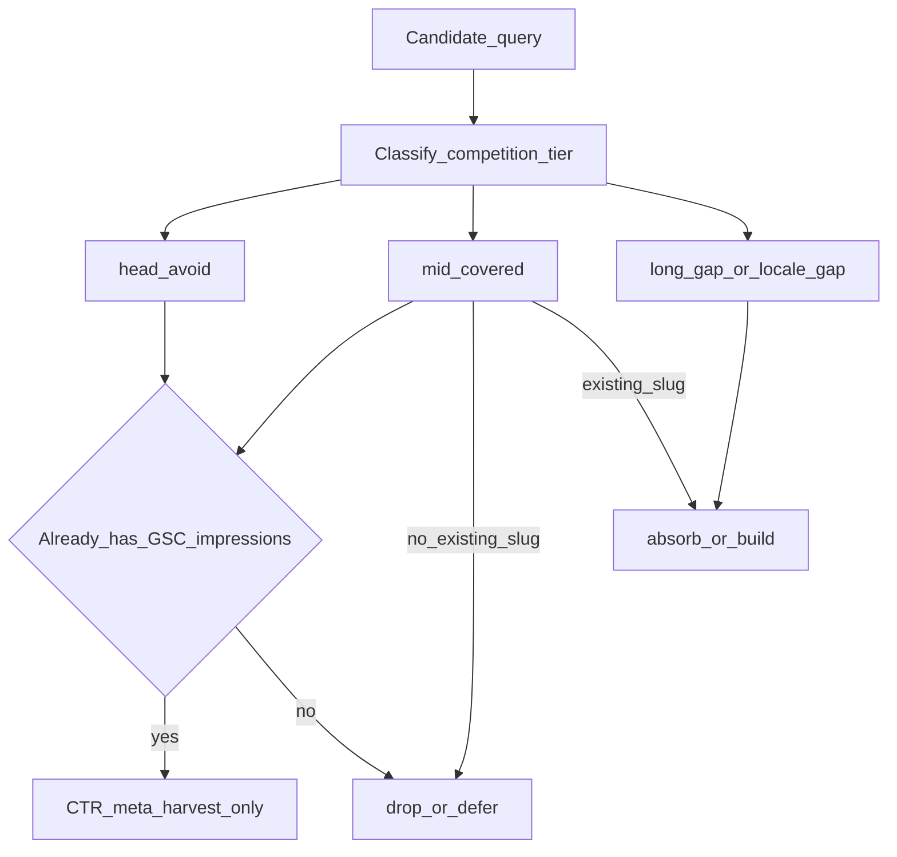

# 长尾缺口优先：SEO 优化策略与执行方案

**日期**: 2026-08-20  
**标签**: `SEO`, `长尾`, `竞品缺口`, `关键词漏斗`, `Information Gain`  
**目标站点**: https://onlinefreetools.org  

**关联**:

- 漏斗执行：[keyword-to-tool-funnel.md](./keyword-to-tool-funnel.md) · Skill [`.cursor/skills/keyword-to-tool-funnel/SKILL.md`](../../.cursor/skills/keyword-to-tool-funnel/SKILL.md)
- **全站词根 Review**：[2026-08-20-tool-keyword-roots.md](./2026-08-20-tool-keyword-roots.md) · [tsv](./2026-08-20-tool-keyword-roots.tsv)
- 事项跟进：[keyword-to-tool-tracker.md](./keyword-to-tool-tracker.md)
- 运维入口：[ops/seo/keyword-to-tool-ops.md](../../ops/seo/keyword-to-tool-ops.md)
- Omni 对标（学结构不学页数）：[../2026-08-08-omnicalculator-seo-traffic-strategy.md](../2026-08-08-omnicalculator-seo-traffic-strategy.md)
- Google 落地底线：[../2026-07-28-google-seo-strategy-implementation.md](../2026-07-28-google-seo-strategy-implementation.md)
- 合规权威：`.cursor/rules/seo-google-policy.mdc` · `tool-i18n-seo.mdc`

> **一句话**：不与已有稳定流量的站点抢它们已吃满的大词；主攻其 **SERP 未覆盖 / 覆盖很薄** 的长尾意图。存量工具用 **词根 → Keyword Planner 长尾 → absorb 功能/SEO**；新意图仍走漏斗周建上限。

---

## 1. 策略变更（相对此前）

| 维度 | 旧习惯风险 | 本策略 |
|---|---|---|
| 选题 | 易被「搜索量大、竞品也强」的大词吸引 | **大词默认回避**（不作新建与主攻 KPI） |
| 对标 | 易跟 Omni / calculator.net / 泛工具站正面硬刚 | **找缺口**：它们无独立页、薄内容、错意图、或语言空白 |
| 产能 | 大词页难出效果却耗尽 IG 预算 | 周产能留给 `long_gap` / `locale_gap` |
| 已有曝光 | 与「抢大词」易混淆 | **已有 GSC 展示的大词/中词仍可做 CTR/meta 收割**（防守，非进攻立项） |

**不改变**：people-first、禁 doorway / scaled content、周建 ≤1–2 满 IG 工具、长尾默认 absorb 进一页、权威序仍以 Google Search Central 为准。

---

## 2. 核心定义

### 2.1 大词（head / 已占位流量词）

同时满足越多，越应标为 **回避**：

1. 意图泛、短、品类级（如 `bmi calculator`、`roi calculator`、`json to yaml`、`neodymium magnets`）
2. SERP 前 3–10 名被 **已有稳定流量** 的品牌/工具站反复占位（Omni、calculator.net、知名转换站、电商/百科等）
3. 前排多为成熟独立工具页或强权威页，本站无差异化入口也难进前页

**处理**：`competition_tier=head` → 默认 `verdict=drop` 或 `defer`；**禁止**为抢该词新建 URL 或把该词设为新工具唯一主词。

### 2.2 竞品已覆盖中长尾（covered）

- 竞品已有 **同意图独立页** 或深度公式/转换页
- 本站新建 = 正面分流，胜算低、合规成本高

**处理**：`competition_tier=mid_covered` → 仅当 catalog **已有同主意图 slug** 时可 `absorb` 补 FAQ/场景；否则 `defer`/`drop`，不立项硬刚。

### 2.3 未覆盖长尾缺口（本策略主战场）

满足 **≥2** 条即可标 `long_gap`（或语言维的 `locale_gap`）：

| 信号 | 说明 |
|---|---|
| SERP 无同意图工具页 | 前排是论坛、Reddit、问答、PDF、视频、泛列表 |
| 竞品页过薄 | 仅定义/广告、无可交互或无公式/边界 |
| 意图更具体 | 单位组合、边界条件、工作流步骤、错误场景、地区/语料说法 |
| 语言缺口 | 大站强 en、弱/无 zh（或本站 L1/L2 语种）；**语言空白视为缺口** |
| 可交互缺口 | 用户要「算/转/生成/校验」，前排只有文章 |

**处理**：优先 `build`（新意图且可行）或 `absorb`（并入已有 slug 的 Use cases / FAQ / Example）。

### 2.4 明确区分：「抢大词」vs「收割已曝光」

| | 抢大词（禁止作进攻） | 收割已曝光（允许） |
|---|---|---|
| 触发 | 看搜索量选大词立项 / 主 title 硬刚品牌站 | GSC **已有展示** 的查询/页面 |
| 动作 | 新建近义页、堆大词密度 | 改 title/desc、补 IG、内链 |
| KPI | 大词排名进前页 | 该 URL 的 CTR / 点击 |

---

## 3. 决策框架（每条候选必填）

在原有漏斗五问之上，**增加竞品覆盖三问**（写入 `serp_notes` / `gap_notes` / `competition_tier`）：

1. **谁在吃这个词？** 前 5–10 名站点类型（品牌工具 / 百科 / 电商 / UGC / 无工具）  
2. **他们覆盖了什么？** 是否有同意图独立页？深度如何？缺交互还是缺公式？  
3. **缺口在哪？** 长尾具体意图、语言、场景、边界——本站能否用 ≥3 条 IG 补上？

### 3.1 `competition_tier` 取值

| 值 | 含义 | 默认 `verdict` 倾向 |
|---|---|---|
| `head` | 大词 / 品牌站已占位 | `drop` / `defer`；有 GSC 展示则只做收割，不新建 |
| `mid_covered` | 竞品已有同意图深页 | 有 slug → `absorb`；无 → `defer`/`drop` |
| `long_gap` | 竞品未覆盖或极薄的具体意图 | `build` 或 `absorb`（优先） |
| `locale_gap` | 同意图在他语强、本目标语弱/无 | 优先本语种 `absorb` 或满 IG 本地化；慎新建近义 en 大词页 |

### 3.2 周选型优先级（强制）

1. `long_gap` 且 `feasibility=yes` 且 IG≥3  
2. `locale_gap`（L1/L2 语种）且可并入已有 slug 或单一新意图  
3. 已有 GSC 展示的 `absorb` 收割  
4. **最后才看** `mid_covered` / `head`（且仅收割，不立项抢位）

周 `build` 名额（≤1–2）**不得**分配给纯 `head` 进攻项。

---

## 4. 执行方案（可操作节奏）

### 4.1 词源怎么取（服务于缺口，而非大词榜）

| 优先 | 来源 | 用法 |
|---|---|---|
| P0 | 相关搜索 / PAA / 自动完成中的 **具体问法** | 从大词种子 **向下展开**，只把长尾候选入池 |
| P0 | SERP 前排「非工具」结果簇 | 标记可交互缺口 → `long_gap` |
| P1 | 本站 GSC：有展示的中长尾、近零点击查询 | `absorb` 收割；勿因此新建 doorway |
| P1 | 竞品 sitemap/品类中 **本站可做且对方无页** 的意图（脱敏笔记） | 缺口清单，不抄正文 |
| P2 | Keyword Planner 量级 | **只作参考**；高量 + 强竞品 = 回避信号，不是立项信号 |

**禁止**：以「月搜量 Top」直接当 `build` 队列；禁止从大词榜逐条建页。

### 4.2 单批分析清单（Agent / 人工）

1. 种子可含大词，但入池候选须 **展开后的长尾** 为主（约 10 条里 `long_gap`/`locale_gap` 建议 ≥6）  
2. 每条填写：`competition_tier`、`gap_notes`（谁占位 + 缺什么，一句）  
3. `head` 且无本站展示 → 不占周 build 名额  
4. 回写 [keyword-daily-pool.tsv](./keyword-daily-pool.tsv) + [keyword-to-tool-tracker.md](./keyword-to-tool-tracker.md)  
5. **不**自动建 `work-tasks/`

### 4.3 内容怎么赢（缺口页的胜负手）

对 `long_gap` / `locale_gap` 上线或 absorb 时，相对「空 SERP」仍须 people-first：

- 真实可交互 + 可见 How + ≥1 Example + FAQ≥3  
- Information Gain ≥3/9 维（公式/边界/场景/对照/引用/隐私/多语/示例/内链）  
- 同簇长尾进 **同一 URL** 的 Use cases / FAQ / 控件预设（一带多场景）  
- 语种：检索向重写，非机翻（`tool-i18n-localization.mdc`）

### 4.4 已有工具页（防守盘）

- 大词已有展示：只做 meta/CTR/IG，**不**再拆近义 URL 冲大词  
- 发现用户实际以长尾进页：把该长尾写入 H2/FAQ/Use cases，强化缺口匹配  
- 排名长期很差的纯大词页：评估是否改主意图叙事到可赢的长尾簇（改文案，不铺量）

### 4.5 链接与发现

- 内链：用已收录页 Related 指向新缺口工具（簇内互链），避免孤岛  
- IndexNow：**增量**提交新 URL / 实质更新 URL，禁止十语全量刷  
- 出站：权威引用；入站：白帽，见 [2026-08-09/link-strategy-execution.md](./2026-08-09/link-strategy-execution.md)

### 4.6 节奏与产能

| 节奏 | 动作 | 产出 |
|---|---|---|
| 按批 | SERP 向下展开 → 缺口分类入池 | 词池行；`long_gap` 占比自检 |
| **存量工具** | 词根清单 → Ads Keyword Planner 拉长尾 → absorb 功能/SEO | 见 §4.7 |
| 每周 | 只从 `long_gap`/`locale_gap` 挑 ≤1–2 个 `build`；其余 absorb | 0～2 个立项候选 |
| 工具交付 | coverage 0b→2/4 → `build:site` → lint:seo | 1 个满 IG 页 |
| 每 2–4 周 | GSC：看长尾查询点击是否起量；大词只看已曝光 CTR | 调池与文案 |

### 4.7 存量工具：词根 → AdWords 长尾 → 功能 / SEO

对**已上线工具**做缺口进攻的主路径（与「日抽新意图」并行）：

| 步骤 | 动作 | 产出 / 落点 |
|---|---|---|
| 1. Review 工具 | 按 catalog 复核意图与 EN title | 全量词根表 |
| 2. 列词根 | 每工具 1–3 个 **primary 大词词根**（仅作种子）+ secondary | [2026-08-20-tool-keyword-roots.md](./2026-08-20-tool-keyword-roots.md) · [tsv](./2026-08-20-tool-keyword-roots.tsv) |
| 3. 手动 AdWords | 用 Google Ads **Keyword Planner**（旧称 AdWords）以词根为种子查相关/长尾；脱敏记录量级与竞争 | `serp-batches/YYYY-MM-DD-adwords-<id>.md` |
| 4. 缺口过滤 | 高量头词 → `head` 不进攻；具体场景/单位/人群等 → `long_gap`/`locale_gap` | [keyword-daily-pool.tsv](./keyword-daily-pool.tsv)，`absorb_slug`=现有工具 |
| 5. 优化功能 | 长尾暴露控件缺口（单位、模式、格式、目标体积等）→ 改页面/brief，**不拆近义 URL** | PR 注明来源长尾 |
| 6. 优化 SEO | 主长尾 → H1/title；次长尾 → desc / FAQ / Use cases / Example；覆盖门禁 | i18n 分片；禁页上关键词堆砌 |

**约束**：词根只作 Planner 种子，不作 title 进攻目标；Planner「大量搜索」头词默认 `head`；同工具多长尾一带多场景；导出含账号数据不入库。

**排期**：每周 **3–5 个 slug** 跑完步骤 3→6（优先已有 GSC 展示，或 SEO/隐私/格式长尾易出缺口的工具）；计算器类必须先展开再入池。

---

## 5. 验收标准（本策略是否在执行）

- [ ] 新入池行含 `competition_tier`；`head` 未进入当周 `build` 进攻队列  
- [ ] 每批约 10 词中，缺口类（`long_gap`+`locale_gap`）占多数  
- [ ] 周建工具的主词不是品类大词，而是可验证的未覆盖具体意图  
- [ ] 无「一词一 URL」长尾拆页；同簇进 FAQ/Use cases  
- [ ] 有 GSC 展示的大词页仅 meta/IG 收割，不新建变体页  
- [ ] 存量工具有词根表；AdWords 长尾经缺口过滤后入池并 absorb  
- [ ] 合规未放宽：无空壳、无抄袭前排、无 AI 灌页

### 5.1 KPI（建议）

| KPI | 说明 |
|---|---|
| 缺口词点击 | GSC 中来自具体长尾查询的点击占比上升 |
| 新工具首词 | 上线 2–4 周内主展现查询应为长尾/场景词，而非纯大词 |
| 大词进攻 | 新建工具 title 主词命中 `head` 的数量 → **目标 0** |
| CTR 收割 | 已曝光 URL 的 CTR（与大词进攻脱钩单独看） |
| 词根批次 | 每周完成 ≥3 slug 的 Planner→absorb 闭环 |

---

## 6. 明确不做

- 为冲 Omni / 泛工具站已垄断的大词而立项或拆页  
- 用搜索量排序替代缺口分类  
- 把「竞品有大词页」当成必须跟进的清单  
- 语言未本地化就用 en 大词页去撞品牌站  
- 以 FAQ 富结果 / `llms.txt` / AI 专用 schema 为成功标准  
- 把 Keyword Planner 头词量直接当 title/立项依据  
- 为 AdWords 长尾批量拆近义 URL  

---

## 7. 与现有文档的关系

| 文档 | 关系 |
|---|---|
| [keyword-to-tool-funnel.md](./keyword-to-tool-funnel.md) | **执行漏斗**；已叠加本文的 `competition_tier` 门禁 |
| [2026-08-20-tool-keyword-roots.md](./2026-08-20-tool-keyword-roots.md) | 全站词根 Review；§4.7 步骤 1–2 产出 |
| Omni / Aconvert 对标文 | 仍「学结构不学页数」；大词正面战升级为 **默认不打** |
| GSC `reviews/*/02-next-strategy.md` | 单轮战术；与本文冲突时：**选题进攻服从本文**，索引/CTR 收割仍服从当轮 GSC |
| `seo-google-policy` | 本文不得放宽 spam / doorway；缺口策略是选题层，不是合规豁免 |

---

## 8. 权威序

冲突时：Google Search Central 现行文档 → `lint:seo` / 运行代码 → `.cursor/rules/*` → 本文 → 其它 docs。  
**冲突须给出判断并经人工确认后再改文件。**
