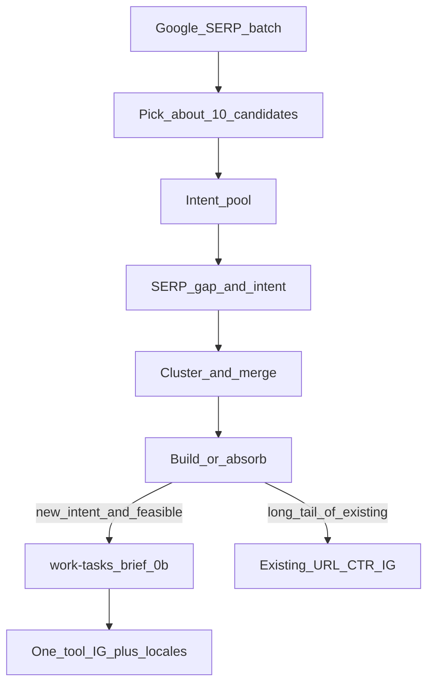

# 关键词 → 工具 → Information Gain 漏斗

**日期**: 2026-08-11  
**目标站点**: https://onlinefreetools.org  

**关联**:

- **独立项跟踪（跟进入口）**：[keyword-to-tool-tracker.md](./keyword-to-tool-tracker.md)
- **Skill（执行）**：[`.cursor/skills/keyword-to-tool-funnel/SKILL.md`](../../.cursor/skills/keyword-to-tool-funnel/SKILL.md)
- 规则：`.cursor/rules/keyword-to-tool-funnel.mdc`
- 合规底线：`.cursor/rules/seo-google-policy.mdc`
- IG 配额 / 禁拆页：`.cursor/rules/tool-i18n-seo.mdc`
- 覆盖门禁：`.cursor/skills/tool-coverage-pass/SKILL.md`
- 现行 GSC 策略：[reviews/2026-08-12/02-next-strategy.md](./reviews/2026-08-12/02-next-strategy.md)
- **长尾缺口优先（选题）**：[2026-08-20-long-tail-gap-strategy.md](./2026-08-20-long-tail-gap-strategy.md)
- Omni 对标（学结构不学页数）：[../2026-08-08-omnicalculator-seo-traffic-strategy.md](../2026-08-08-omnicalculator-seo-traffic-strategy.md)
- 运行表模板：[keyword-daily-pool.tsv](./keyword-daily-pool.tsv)
- SERP 批次归档：[serp-batches/README.md](./serp-batches/README.md)

> **一句话**：从谷歌搜索批量取词进意图池（分析用）→ **竞品覆盖分类（回避大词、主攻未覆盖长尾）** → 合并过滤 → **每周立项 1–2 个**真实可交互工具并做满 Information Gain；禁止「一词一 URL」日建页。

**选题战略（2026-08-20）**：[2026-08-20-long-tail-gap-strategy.md](./2026-08-20-long-tail-gap-strategy.md) — 不与已有流量站抢已占位大词；主攻其未覆盖/极薄的长尾与语言缺口。已有 GSC 展示的大词仅做 CTR 收割，不作进攻立项。

---

## 1. 为什么不是「每天 10 词 = 每天 10 工具」

| 风险 | 说明 |
|---|---|
| Scaled content abuse | Google 政策方法无关：主要为操纵排名的批量页（含未实质编辑的 AI）即违规 |
| Doorway | 一词一 URL、仅换 title/H1 → 站规禁止 |
| 产能 | 每工具须可交互 + IG≥3/9 维 + FAQ≥3 + `work-tasks` + coverage 0b/2/4 + 十语检索向重写 |
| 与 P0 冲突 | 有展示少点击时，应先改 CTR/meta，不是狂加 URL |

粗算：日产 10 工具 × 10 语 ≈ 日更 100 页，极易呈「批量无增量」观感。

---

## 2. 漏斗总览

| 层 | 动作 | 产出 |
|---|---|---|
| 1 | 批量 Google SERP 入库 → 抽约 10 候选进池 | [keyword-daily-pool.tsv](./keyword-daily-pool.tsv) 行；**0 新 URL** |
| 2 | 意图聚类 / 近义合并 | `absorb` 或单一主意图候选 |
| 3 | 建站门禁（每周 1–2） | 仅当人工决定创建工具时：再开 `work-tasks/{slug}/` + coverage `0b` |
| 4 | Information Gain + 十语 | 可上线工具页 |
| 5 | 已有页收割 | title/desc/FAQ/Use cases；不新建 URL |

> **边界**：事项跟进用 [keyword-to-tool-tracker.md](./keyword-to-tool-tracker.md)。`work-tasks/` **只为创建工具服务**，不为「跟进本漏斗」自动建夹。

---

## 3. 词源：谷歌搜索批量获取（仅供分析）

### 3.1 定位

| 角色 | 说明 |
|---|---|
| 主词源 | 批量 Google SERP（相关搜索 / 人们还问 / 联想 / 结果标题与摘要线索） |
| 用途 | 意图发现、竞品结构对照、IG 缺口、是否可并入现有 slug |
| 非用途 | 不直接驱动日建 URL；不抄竞品正文；不按 SERP 标题批量生成 doorway |

词表来源可不固定；**稳定的是分析字段与建站门禁**，不是某一固定词库。

### 3.2 合规边界

- SERP 数据 = **研究输入**；页面正文必须自写 + people-first
- 禁止整段照搬前排结果；禁止「SERP 标题模板 → 空壳工具」流水线
- 取词方式自行合规（ToS / 频率）；仓库只存 **脱敏分析摘要与候选词**，不要求入库原始 HTML
- 有 GSC 时：对 `build` 候选对照是否已有展示意图（已有曝光优先改 CTR）；无 GSC 不阻塞分析，但上线仍受周产能限制

### 3.3 辅助校验（非主词源）

- 本站 GSC 查询 / 页面
- Omni shortlist / [工具方向](../2026-07-28-tool-direction.md) 可行性
- `tool-catalog.json` 撞意图检查

### 3.4 每条候选必答

1. 用户任务是什么？能否做成 **浏览器内可交互** 工具？  
2. SERP 前排缺什么？能否用 **≥3 条 IG** 补上？  
3. 是否与站内已有 slug **同一主意图**？→ 优先 `absorb`  
4. 是否只是近义换词？→ 禁止拆页，进 Use cases / FAQ  
5. YMYL？→ disclaimer + 引用成本更高，可 `defer`  
6. **竞品覆盖**（见长尾缺口策略）：谁在占位？是否大词/已覆盖？还是未覆盖长尾 / 语言缺口？→ 填 `competition_tier` + `gap_notes`

### 3.5 `competition_tier`（选题门禁）

| 值 | 含义 | 周 `build` |
|---|---|---|
| `head` | 大词；品牌/流量站已占位 | **禁止进攻**；无本站展示 → `drop`/`defer`；有展示 → 仅 CTR 收割 |
| `mid_covered` | 竞品已有同意图深页 | 无 slug → 不立项；有 slug → 可 `absorb` |
| `long_gap` | 未覆盖或极薄的具体意图 | **优先** `build` / `absorb` |
| `locale_gap` | 他语强、目标语弱/无 | 优先该语种 absorb / 满 IG 本地化 |

周立项名额只分配给 `long_gap` / `locale_gap`（详见 [2026-08-20-long-tail-gap-strategy.md](./2026-08-20-long-tail-gap-strategy.md) §3–§4）。

### 3.6 `verdict` 取值

| 值 | 含义 |
|---|---|
| `build` | 新意图 + 可行 + 有 IG 缺口 + **非 head 进攻** → 进入周立项候选 |
| `absorb` | 并入已有 slug（改 meta / FAQ / Use cases） |
| `defer` | 意图成立但产能/YMYL/技术未就绪，或 mid_covered 暂不硬刚 |
| `drop` | 不可做成工具、重复、无增量，或纯大词无展示不值得跟 |

---

## 4. 意图合并（防 doorway）

对齐 `tool-i18n-seo.mdc`：

- **默认**：同一工具页用 Use cases + FAQ 覆盖多场景（一带多场景）
- **可拆独立 URL**：仅当功能、参数、算法或正文有实质差异，且独立满足 IG 配额
- **自检**：去掉 title 后正文是否仍明显不同？是否有独立 Example/边界？会否形成 doorway？

---

## 5. 建站门禁（每周 1–2，上限建议 ≤3）

候选须同时满足：

1. **真实交互**（非纯文案页）  
2. 相对 SERP 能写出 **≥3 条 IG**（九维见下节）  
3. 技术可行（工具方向 A/B/C）  
4. 不与 catalog 现有 slug 撞同一主意图  
5. **`competition_tier` 为 `long_gap` 或 `locale_gap`**（禁止纯 `head` 进攻立项）  
6. 流水线：`work-tasks/{slug}/` → `npm run coverage:gate -- --slug=… --phase=0b` → 实现 → phase `2`/`4` → `build:site` + `lint:seo`

---

## 6. Information Gain（上线硬性）

IG 是内容策略原则（对齐 Helpful Content），**不是**已确认的独立排名因子。上线前至少满足九维中的 **3 项**，并在 `02-tool-info.md` / PR 写明落点：

1. 公式/规则  
2. 边界/失败  
3. 场景语境  
4. 对照表  
5. 权威引用  
6. 本地隐私  
7. 多语言实质重写  
8. 数值示例  
9. 主题内链 `related ≥ 2`

另须：可见 How + ≥1 Example；FAQ ≥3；禁止「快、安全、免费」零增益页。

---

## 7. 产能日历

| 节奏 | 动作 | 产出 |
|---|---|---|
| 按批 / 每天 | SERP 批量入库 → 抽约 10 候选 + 填分析字段 | 词池行，0 新 URL |
| 每周 | 从池中选 1–2 个 `build` | `work-tasks` + coverage `0b` |
| 随后 3–7 天 | 做满 1 个工具至可上线 | 1 个满 IG 工具 |
| 每 2–4 周 | GSC 复盘 | 调 CTR / 补 IG / 下批评审 |

**日抽约 10 词 = 意图发现节奏；周建 1–2 工具 = 上线节奏。**

---

## 8. 运行表与批次文件

| 文件 | 用途 |
|---|---|
| [keyword-daily-pool.tsv](./keyword-daily-pool.tsv) | 候选总表（追加行；含 SERP 分析字段） |
| [serp-batches/](./serp-batches/) | 按批归档脱敏摘要（可选）；见该目录 README |

### 池表列说明

| 列 | 含义 |
|---|---|
| `date` | 写入日 YYYY-MM-DD |
| `seed_query` | 本次 Google 搜索种子词 |
| `candidate` | 进入池的候选词/短语 |
| `locale` / `gl` | 语言与地区 |
| `source_batch` | `serp-batches/` 下批次文件名（无路径） |
| `related_or_paa` | 相关搜索 / PAA / 联想来源摘要 |
| `serp_notes` | 前排结果类型与共性 |
| `ig_opportunity` | 相对 SERP 可补的增量（一句） |
| `absorb_slug` | 可并入的 catalog slug；新建则空 |
| `feasibility` | `yes` / `no` / `maybe`（浏览器可做） |
| `verdict` | `build` / `absorb` / `defer` / `drop` |
| `competition_tier` | `head` / `mid_covered` / `long_gap` / `locale_gap` |
| `gap_notes` | 谁占位 + 缺口一句（未覆盖/薄/语言等） |
| `notes` | 其他 |

---

## 9. 明确不做

- 一词一工具日更流水线  
- SERP 标题 → 空壳页流水线  
- 抄袭前排结果正文  
- 为 GSC/SERP 查询批量建近义 URL  
- 未过 0b / 无交互 / 无 IG 的占位工具进 sitemap  
- 以 FAQ 富结果 / `llms.txt` / AI 专用 schema 为 KPI  
- **与流量站正面硬刚已占位大词**（搜索量排序当立项队列；纯 `head` 进周 build）  

---

## 10. 权威序

冲突时：Google Search Central 现行文档 → `lint:seo` / 运行代码 → `.cursor/rules/*` → 本文。本文不得放宽 scaled content / doorway 红线。

---

## 11. 首批分析记录（2026-08-11）

| 项 | 内容 |
|---|---|
| 批次 | [serp-batches/2026-08-11-pilot01.md](./serp-batches/2026-08-11-pilot01.md) |
| 词池 | [keyword-daily-pool.tsv](./keyword-daily-pool.tsv)（10 行，`source_batch=2026-08-11-pilot01`） |
| `build` 候选 | 词池标记 `safe-paste-cleaner`（**未**建 work-tasks；开工具须另决议） |
| 其余 | 6× `absorb` 既有工具；2× `defer`；近义 invisible → 同一意图不拆页 |
| 事项跟进 | [keyword-to-tool-tracker.md](./keyword-to-tool-tracker.md) |
